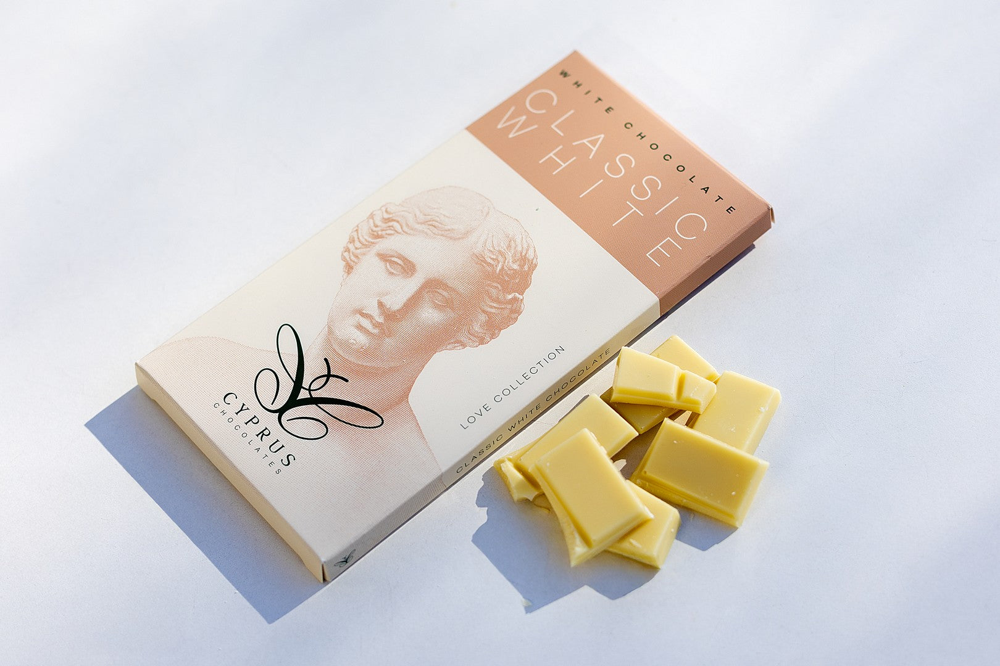
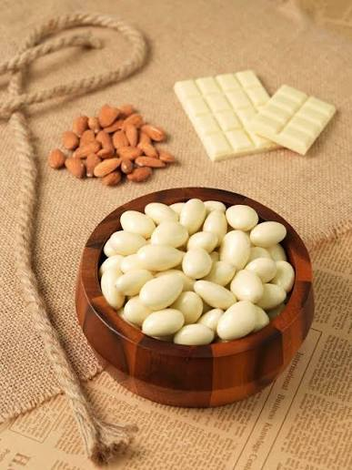
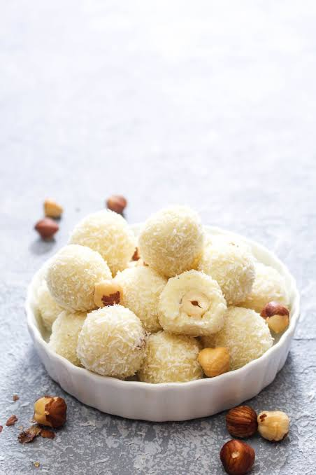
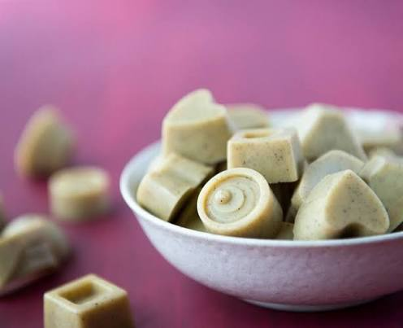
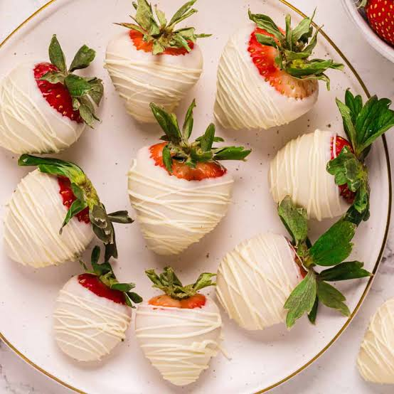
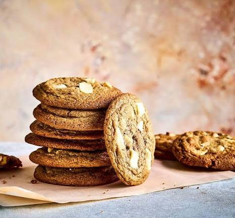
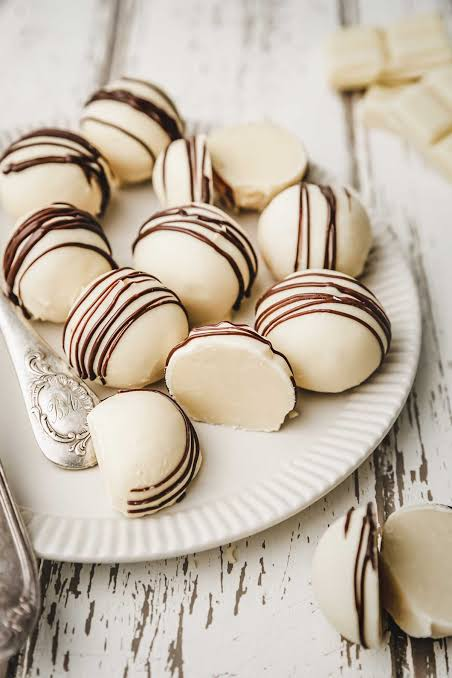

<!DOCTYPE html>
<html lang="en">
<head>
<meta charset="UTF-8">
<meta name="viewport" content="width=device-width, initial-scale=1.0">

<title>White Chocolate | Chocotastic</title>

</head>

<body>

<header>

<a href="cart.html" class="cart-btn">
🛒 Cart
</a>

Your Logo Here

</header>

<h1>White Chocolate Collection</h1>

Premium White Chocolates for Every Sweet Moment

<h3>Classic White Chocolate</h3>

৳320

<button class="details">View Details</button>
<button class="addcart">🛒</button>

<h3>Almond White Chocolate</h3>

৳380

<button class="details">View Details</button>
<button class="addcart">🛒</button>

<h3>Hazelnut White Chocolate</h3>

৳400

<button class="details">View Details</button>
<button class="addcart">🛒</button>

<h3>Vanilla White Chocolate</h3>

৳350

<button class="details">View Details</button>
<button class="addcart">🛒</button>

<h3>Strawberry White Chocolate</h3>

৳420

<button class="details">View Details</button>
<button class="addcart">🛒</button>

<h3>Cookies White Chocolate</h3>

৳390

<button class="details">View Details</button>
<button class="addcart">🛒</button>

<h3>Caramel White Chocolate</h3>

৳430

<button class="details">View Details</button>
<button class="addcart">🛒</button>

<h3>Premium White Truffle</h3>

৳480

<button class="details">View Details</button>
<button class="addcart">🛒</button>

<footer>

© 2026 Chocotastic | Crafted with Love 🍫

</footer>

</body>
</html>
